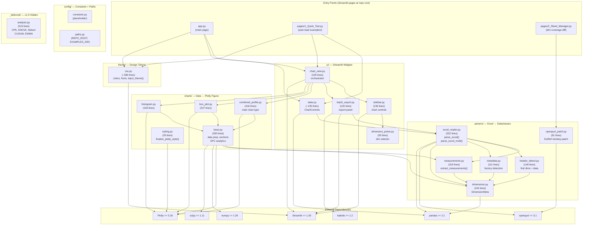
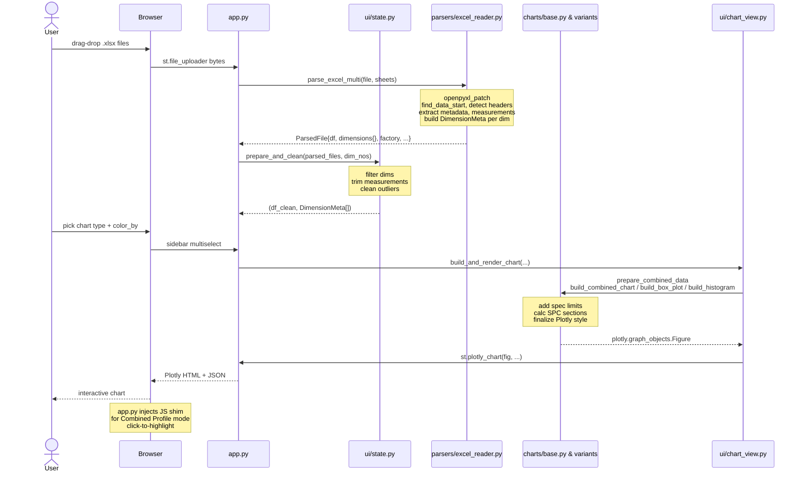

# SPC Data Visualization — Architecture (Phase 1)

Current state after refactoring: code reorganized into layered `src/spc_viz/` package.
User-facing behavior unchanged. Tests and examples remain functional.

**Last Updated:** 2026-05-08

---

## 1. Module Structure

**Legend:**
- **Parsers layer** — stateless Excel→dataclass pipeline. No Streamlit/Plotly deps.
- **Charts layer** — pure Plotly Figure construction + SPC math (base.py). No Streamlit.
- **UI layer** — Streamlit widgets + session state. Calls parsers + charts, renders with st.*.
- **Theme** — CSS tokens. Injected by ui/sidebar.py.
- **Config** — app-wide constants and path helpers.
- **_deferred/** — Analysis features disabled in v1.0 (CPK, Nelson rules, CUSUM, EWMA, ANOVA).
  Kept in source for Phase 2 re-enablement. Not imported by active code.

---

## 2. Data Flow — Upload to Rendered Chart

---

## 3. Layered Architecture

### Parsers (`src/spc_viz/parsers/`)

**Contract:** Excel bytes → `DimensionMeta` dataclass + `pandas.DataFrame`

- `openpyxl_patch.py` — Monkey-patch `ExternalReference` load to handle malformed XLNK refs.
- `dimensions.py` — Data models: `DimensionMeta` (spec, unit, target), `ParsedFile` envelope.
- `header_detect.py` — Scan first 50 rows for dimension number + data start row.
- `metadata.py` — Extract metadata columns (part #, serial, date); auto-detect factory.
- `measurements.py` — Extract measurement rows; deduplicate identical rows.
- `excel_reader.py` — Orchestrator: `parse_excel()` single sheet, `parse_excel_multi()` all sheets.

**Key property:** No Streamlit or Plotly imports. Can be used in scripts or tests without UI.

### Charts (`src/spc_viz/charts/`)

**Contract:** Cleaned DataFrame + `DimensionMeta[]` → `plotly.graph_objects.Figure`

- `base.py` — Shared data prep (sections by date, color palettes, SPC calcs: mean, sigma, control limits).
- `combined_profile.py` — Main multi-dimension SPC chart (lines per dim, color by factory/serial).
- `box_plot.py` — Box plot by factory or serial.
- `histogram.py` — Histogram with mean/spec overlay.
- `styling.py` — `finalize_plotly_style()` — margin, font, legend, hovertemplate tune.

**Key property:** No Streamlit imports. Figures are plain Plotly; testable in REPL.

### UI (`src/spc_viz/ui/`)

**Contract:** Streamlit widgets + session state + orchestration

- `state.py` — `ChartControls` dataclass; `prepare_and_clean()` filters/cleans data.
- `sidebar.py` — Chart type + color_by + threshold selectors + color pickers.
- `batch_export.py` — Batch export panel (Ctrl+click to select; export PNG/XLSX).
- `dimension_picker.py` — Multi-select dimensions + point filter (date range, value bounds).
- `chart_view.py` — `build_and_render_chart()` — calls parsers + charts + `st.plotly_chart()`.

**Key property:** Only layer that imports Streamlit. Session-state keys use `key_prefix` per page.

### Theme (`src/spc_viz/theme/`)

- `css.py` — CSS class + design tokens (Slate palette, Inter/Courier Prime fonts, custom scrollbar).
  Exported as `THEME_CSS` string; injected by sidebar via `st.markdown(..., unsafe_allow_html=True)`.

### Config (`src/spc_viz/config/`)

- `paths.py` — `REPO_ROOT`, `EXAMPLES_DIR` helpers (used by Quick Test to auto-discover `.xlsx`).
- `constants.py` — Reserved for app-wide settings (v1.0: empty).

### Hidden (`src/spc_viz/_deferred/`)

- `analysis.py` — CPK, ANOVA, Nelson rules, CUSUM, EWMA. Disabled in v1.0 (no imports from active code).
  Kept for Phase 2 re-enablement without file recreation.

---

## 4. Entry Points

All three remain at repo root (Streamlit requirement):

| File | Purpose | Dependencies |
|------|---------|--------------|
| `app.py` | Upload vendor files → pick sheets → chart dims | parsers, charts, ui, theme |
| `pages/1_Quick_Test.py` | Auto-load `.xlsx` from `examples/` → fast iteration | parsers, charts, ui, theme |
| `pages/2_Sheet_Manager.py` | Diff dimension coverage between two files (set logic only) | parsers only |

**Session isolation:** Each page passes `key_prefix = "main_"`, `"qt_"`, `"sm_"` to UI functions.
Prevents widget-key collisions across pages in shared Streamlit session state.

---

## 5. External Dependencies

| Library    | Purpose | Version |
|------------|---------|---------|
| streamlit  | Web framework, widgets, session state, multi-page routing | ≥ 1.30 |
| plotly     | Interactive chart construction (Figure, Scatter, Box, Histogram) | ≥ 5.18 |
| openpyxl   | `.xlsx` parsing (isolated to `parsers/`) | ≥ 3.1 |
| pandas     | DataFrames, groupby, aggregations | ≥ 2.1 |
| numpy      | Numeric helpers (percentile, std, mean) | ≥ 1.26 |
| scipy      | `scipy.stats` for capability / Nelson rule analysis | ≥ 1.11 |
| kaleido    | Server-side PNG export (Batch Export feature) | ≥ 1.2 |

**Dev tools** (in `pyproject.toml[project.optional-dependencies.dev]`):
- pytest ≥ 8.0, pytest-cov ≥ 4.1
- ruff ≥ 0.4 (linter/formatter)
- mypy ≥ 1.10 (type checker)
- pre-commit ≥ 3.7

---

## 6. Migration from Phase 0

**What changed:** Code reorganized from flat root (7 modules) to layered `src/spc_viz/` package (18 modules, 4 subpackages).

**Why:** Improve maintainability, enable future packaging/distribution, allow isolated testing of parsers and charts without Streamlit.

**What stayed the same:** User-facing behavior (all chart types, export, UI flow). Test suite still passes (snapshot + unit tests remain unaffected). Examples/ directory moved but still auto-discovered.

**Breaking changes:** None for end users. Developers must update imports (`from spc_parser import ...` → `from src.spc_viz.parsers.excel_reader import ...`).

---

**Test Coverage:**
- `tests/test_spc_charts.py` — 24 unit tests (parsers, charts)
- `tests/snapshot_test.py` — 4 visual regression scenarios
- `tests/fixtures/` — Sample `.xlsx` files (symlinked to vendor data)
- `tests/golden/` — Reference PNG images for visual baseline

**Tooling:**
- `.python-version` → 3.10
- `pyproject.toml` → hatchling build, ruff/mypy/pytest config
- `.pre-commit-config.yaml` → ruff format/lint, file checks
