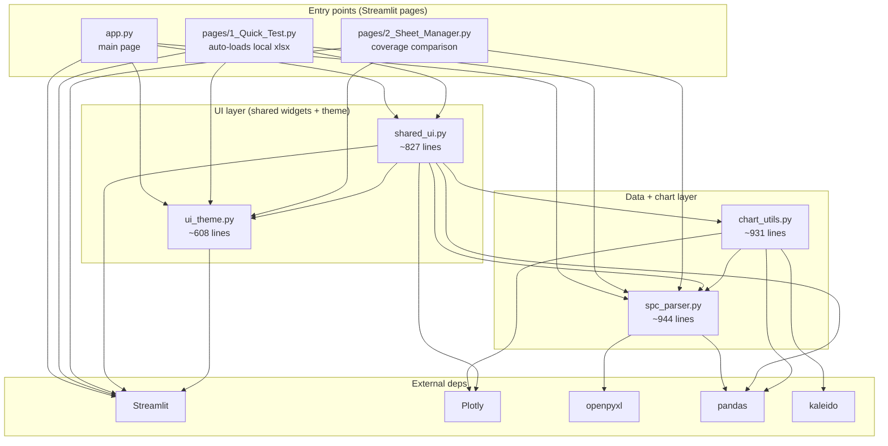
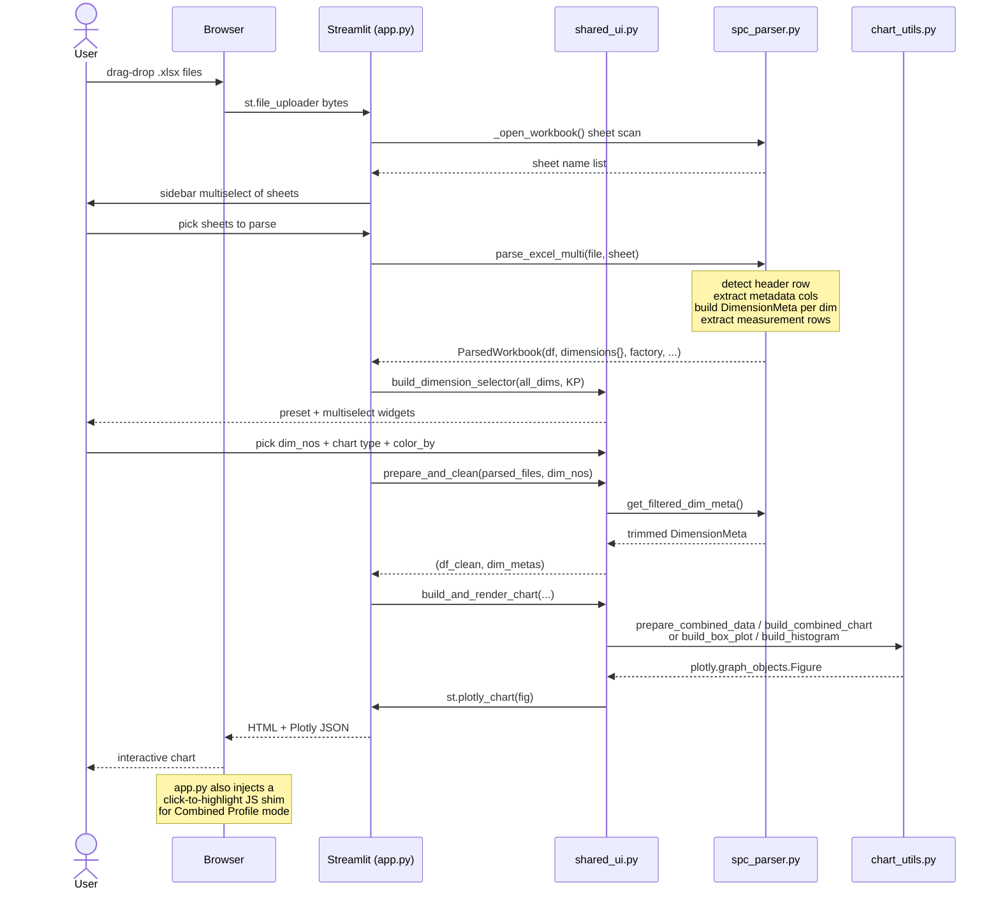

# SPC Data Visualization — Architecture (Current State)

Snapshot of the codebase as it exists on branch `feature/code-quality-refactor`.
Describes the seven Python modules shipped today, how they import each other,
and the runtime path a user's `.xlsx` file takes on the way to a rendered chart.

---

## 1. Module Diagram

Notes:
- `shared_ui.py` is the fan-in hub: both main pages and Quick Test route through
  the same widget builders (`build_dimension_selector`, `build_chart_controls`,
  `build_and_render_chart`, `render_summary_statistics`, `render_batch_export`).
- `chart_utils.py` never imports Streamlit — it is pure Plotly figure construction
  plus stats helpers (`calc_process_capability`, `nelson_rules`, `cusum_analysis`).
  The UI layer wraps it.
- `spc_parser.py` never imports Streamlit or Plotly — it is the only module that
  touches `openpyxl`. Everything above it depends on its `DimensionMeta`
  dataclass and the `ParsedWorkbook` dicts.
- `ui_theme.py` is leaf-level: exports design tokens (colors, fonts) and the
  `inject_theme()` function that writes CSS via `st.markdown(..., unsafe_allow_html=True)`.
- Sheet Manager deliberately **does not** depend on `shared_ui` or `chart_utils`
  — it is a standalone comparison tool, not a chart viewer.

---

## 2. Data Flow — Upload to Rendered Chart

---

## 3. Why the Structure Looks This Way

The app has **three entry points** because they serve distinct user intents.
`app.py` is the production SPC workflow: upload vendor files, pick sheets, chart
dimensions. `pages/1_Quick_Test.py` is a developer aid — it auto-discovers every
`.xlsx` in the project root and skips the upload widget, so iterating on chart
or parser code costs zero clicks. `pages/2_Sheet_Manager.py` is a side tool for
diffing dimension coverage between two files; it intentionally bypasses the
chart stack because its job is set comparison, not visualization.

**Session-state isolation** is handled by a convention, not a framework feature:
every `shared_ui` function takes a `key_prefix` argument, and each page passes
its own namespace — `KP = "main_"` in `app.py`, `KP = "qt_"` in Quick Test. That
prevents widget-key collisions when Streamlit reuses its single session-state
dict across pages.

The **critical seams** are two. First, the parser-to-UI boundary: `spc_parser`
returns plain dataclasses and DataFrames — it has no awareness of Streamlit —
which means the parser can be unit-tested without a browser. Second, the
UI-to-charts boundary: `chart_utils` returns raw Plotly `Figure` objects, and
only `shared_ui` is allowed to call `st.plotly_chart`. That keeps chart logic
testable in a REPL and consolidates every `st.*` call in one module.

The app runs as a **permanent launchd service on `http://localhost:8504`** (see
`logs/streamlit.log`). The plist keeps the Streamlit server alive across
reboots so the user can bookmark the URL — exact plist path and on-login vs
always-on policy is flagged as unconfirmed in US-018.

---

## 4. External Dependencies

| Library    | Role                                                    | Version (requirements.txt) |
| ---------- | ------------------------------------------------------- | -------------------------- |
| streamlit  | Web framework, session state, widgets, page routing     | unpinned                   |
| openpyxl   | `.xlsx` parsing (only used inside `spc_parser.py`)      | unpinned                   |
| pandas     | DataFrames for measurement data and group-by operations | unpinned                   |
| plotly     | Interactive figure construction (charts + subplots)     | unpinned                   |
| numpy      | Numeric helpers, used by chart and stats code           | unpinned                   |
| scipy      | `scipy.stats` for capability / Nelson / CUSUM analysis  | unpinned                   |
| kaleido    | Server-side PNG export for the Batch Export feature     | unpinned                   |

All seven dependencies are listed without version pins in `requirements.txt`,
so reproducibility relies on whatever pip resolves at install time.
