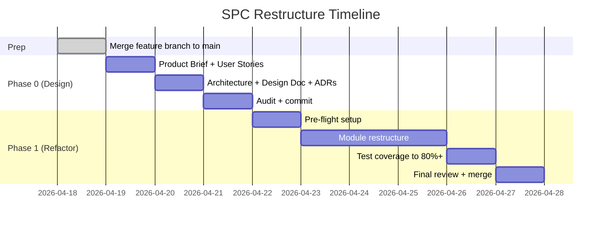
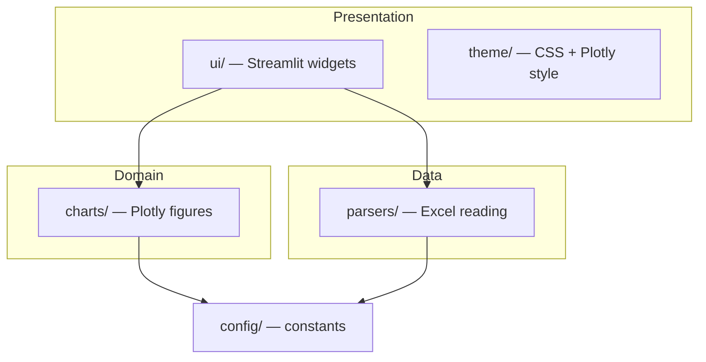
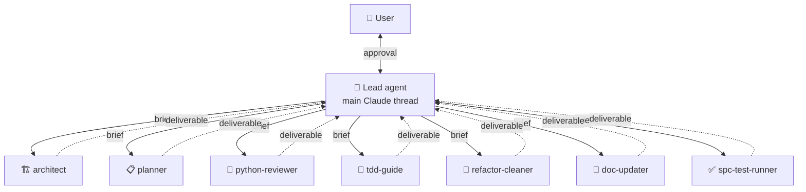

# SPC Data Viz — Restructure Design Doc

**Date:** 2026-04-18
**Status:** Approved by user (all 5 sections)
**Author:** Lead agent (Claude, main thread) + user (Zhefeng)

---

## 1. Context

The SPC Data Visualization app is a working Streamlit multi-page tool used by a quality engineer to analyze manufacturing dimension data from Excel inspection files. It was built iteratively without formal software-design process — user describes their workflow as "add something, not thinking of something structured."

Current state (on branch `feature/code-quality-refactor`):
- 4,658 lines of Python across 8 source files
- 4 files > 600 lines (too large)
- No README, PRD, architecture docs, pyproject.toml, type hints, linting, or CI
- Sample xlsx files mixed into repo root
- 24 pytest tests (basic coverage)
- Flat file layout (no `src/` package structure)

## 2. Goals

1. Apply real software-development process retroactively without changing the app's behavior or UI
2. Produce modern lightweight planning docs (Product Brief, User Stories, Architecture, Design Doc, ADRs) that a real team would have
3. Refactor code into proper Python package with layered architecture
4. Add modern tooling (pyproject.toml, ruff, mypy, pre-commit, pytest-cov)
5. Teach user SWE concepts via "audit at each milestone" checkpoints
6. Use a multi-agent team with lead/supervisor pattern

## 3. Non-Goals

- No UX or feature changes — app behaves identically after refactor
- No deployment / multi-user / cloud features
- No statistical analysis features (no ANOVA, regression, etc.)
- No replacement of CPK calculation logic owned by QE team

## 4. Decisions Summary

| Decision | Choice | Why |
|---|---|---|
| Scope of change | **Option B: Refactor + modernize** | Keeps working UI/features; reorganizes internals + adds tooling |
| Doc format | **Modern lightweight** (1-2 pages each, Mermaid-first) | Not waterfall; real team format |
| User involvement | **Lightweight checkpoints** (audit per milestone) | User has zero SWE experience but wants to audit |
| Agent team | **6 specialist sub-agents + lead** | Mirrors a real software team |
| Execution order | **Strict waterfall**: Phase 0 fully done before Phase 1 | Clean audit trail + best learning signal |
| Audit format | **One question at a time** | User explicitly asked to avoid multi-question dumps |
| Verification | **4 layers** (pytest, visual regression, pre-commit, smoke test) | Skip CI for now |

## 5. Phases & Timeline



Total: ~8 days agent work, mostly parallel.

## 6. Git Strategy

Three branches in sequence:

```
main
 ├── feature/code-quality-refactor (current)  ──merge──▶ main, tag v0.1-baseline-stable
 ├── docs/phase-0-design                      ──merge──▶ main, tag v0.2-designed
 └── refactor/phase-1-structure               ──merge──▶ main, tag v1.0
```

### Safety layers (user concern: working app must not break)
1. **Tag `v0.1-baseline-stable`** before any work → permanent rollback anchor
2. **Separate branches** → current branch untouched
3. **Git worktrees** for Phase 1 → running launchd service at `http://localhost:8504` stays on main branch, refactor happens in sibling directory `Data_Visualiztion_refactor/`

```bash
# Before Phase 1:
git worktree add ../Data_Visualiztion_refactor refactor/phase-1-structure
```

## 7. Phase 0 Deliverables

All go in `docs/` folder. Lightweight formats, under ~2 pages each.

```
docs/
├── README.md                    ← index
├── 00-product-brief.md          ← Amazon "working backwards" 1-pager
├── 01-user-stories.md           ← agile user stories + acceptance criteria
├── 02-architecture.md           ← Mermaid diagrams (module + data flow)
├── 03-design-doc.md             ← Google/Meta-style tech design
├── adr/                         ← architecture decision records (MADR-lite)
│   ├── 0001-streamlit-over-flask.md
│   ├── 0002-plotly-over-matplotlib.md
│   ├── 0003-kaleido-for-export.md
│   ├── 0004-openpyxl-monkey-patch.md
│   └── 0005-src-layout-for-package.md
└── plans/
    └── 2026-04-18-spc-restructure-design.md   ← THIS DOC
```

## 8. Phase 1 Target Architecture

### Layered structure



**Rule:** dependencies point down only. `parsers/` never imports `ui/`.

### Target file layout

```
Data Visualiztion/
├── pyproject.toml              ← NEW modern project config
├── README.md
├── .python-version
├── ruff.toml
├── .pre-commit-config.yaml
│
├── src/spc_viz/
│   ├── main.py                 ← was app.py (310 lines)
│   │
│   ├── parsers/                ← was spc_parser.py (944 → 6 files)
│   │   ├── header_detect.py        ~150 lines
│   │   ├── metadata.py             ~150 lines
│   │   ├── dimensions.py           ~150 lines
│   │   ├── measurements.py         ~150 lines
│   │   ├── openpyxl_patch.py       ~50 lines
│   │   └── excel_reader.py         ~150 lines
│   │
│   ├── charts/                 ← was chart_utils.py (931 → 7 files)
│   │   ├── base.py                 ~100 lines
│   │   ├── combined_profile.py     ~200 lines
│   │   ├── box_plot.py             ~150 lines
│   │   ├── histogram.py            ~100 lines
│   │   ├── spec_limits.py          ~100 lines
│   │   ├── styling.py              ~150 lines
│   │   └── export.py               ~150 lines
│   │
│   ├── ui/                     ← was shared_ui.py (827 → 6 files)
│   │   ├── sidebar.py              ~200 lines
│   │   ├── upload.py               ~100 lines
│   │   ├── dimension_picker.py     ~100 lines
│   │   ├── chart_view.py           ~150 lines
│   │   ├── batch_export.py         ~150 lines
│   │   └── state.py                ~150 lines
│   │
│   ├── theme/                  ← was ui_theme.py (608 → 2 files)
│   │   ├── css.py                  ~400 lines
│   │   └── plotly_theme.py         ~200 lines
│   │
│   └── config/
│       ├── constants.py            ~100 lines
│       └── paths.py                ~50 lines
│
├── pages/                      ← Streamlit multi-page requirement stays at root
│   ├── 1_Quick_Test.py         ← thin wrapper (~50 lines)
│   └── 2_Sheet_Manager.py      ← thin wrapper (~50 lines)
│
├── tests/
│   ├── conftest.py
│   ├── test_parsers/
│   ├── test_charts/
│   ├── test_ui/
│   └── test_integration.py
│
├── examples/                   ← NEW: sample .xlsx moved out of root
│   └── *.xlsx
│
├── scripts/
│   ├── run_dev.sh
│   └── run_server.sh           ← launchd plist updated to call this
│
└── docs/                       ← from Phase 0
```

### Modern tooling

| Tool | Purpose | Replaces |
|---|---|---|
| `uv` | Package manager (10x faster) | pip, venv |
| `pyproject.toml` | Project config + deps | requirements.txt |
| `ruff` | Lint + format | flake8 + black + isort |
| `mypy` | Type checking | none |
| `pytest-cov` | Coverage | basic pytest |
| `pre-commit` | Auto-run checks on commit | none |

## 9. Agent Team & Orchestration

### Hierarchy



### Sub-agent roster

| # | Agent | Role | Phase |
|---|---|---|---|
| 1 | architect | Diagrams, Design Doc, ADRs | 0 |
| 2 | planner | Product Brief, User Stories | 0 |
| 3 | python-reviewer | Python code quality review | 1 |
| 4 | tdd-guide | Write tests first per module | 1 |
| 5 | refactor-cleaner | Dead code / orphan detection | 1 |
| 6 | doc-updater | Sync docs with code changes | 0 & 1 |
| 7 | spc-test-runner | Full suite + visual chart regression | 0 & 1 |

### Lead review protocol (6 steps per sub-agent delivery)

1. **Dispatch** — structured brief (goal, scope, acceptance criteria, context)
2. **Execute** — sub-agent works in isolation
3. **Quality gate** — lead checks 3 gates: structural, content, integration
4. **Decision**:
   - ✅ Pass → add to consolidated report
   - ❌ Minor fail → feedback + re-dispatch (max 2 retries)
   - ❌ Major fail → spawn 2nd reviewer agent to cross-check
   - 🔴 Persistent fail → escalate to user
5. **Aggregate** — lead writes executive summary
6. **Present** — one question at a time

### Audit format (one question at a time — user mandate)

Lead asks **one question per message**:

```
Phase 0 Wave 1 — Audit (1 of 3)

On the Product Brief: I described your users as "...". Is this right?
- A) Yes
- B) No, actually: ___
```

User replies → next question. After all questions: one short FYI warnings block → next wave.

## 10. Verification Strategy (4 layers)

1. **pytest suite** — runs after every file change, stays green
2. **Visual chart regression** — spc-test-runner captures golden PNGs before refactor, compares after each module refactor
3. **Pre-commit hooks** — refuses to commit if ruff/mypy/pytest fail
4. **End-of-phase smoke test** — real xlsx upload → render all chart types → batch export → verify ZIP

CI (GitHub Actions) deferred to future.

## 11. Risks & Mitigations

| Risk | Mitigation |
|---|---|
| Refactor breaks working app | Git tag baseline + worktrees + pre-commit hooks + visual regression |
| User doesn't understand audit questions | Lead explains context in each question; linked examples |
| Sub-agent produces wrong output | Max 2 retries, then escalate to user |
| Phase 1 takes longer than estimated | Strict module-by-module commits allow pausing any time |
| Launchd service disrupted | Runs from main branch; Phase 1 work in separate worktree |

## 12. Open Questions

- Does the user have a git remote (for `git push origin --tags`)? **To confirm at Prep step.**
- Any custom requirements for Python version (currently 3.10 via .venv)? **Default to 3.10.**

## 13. Next Steps

1. Commit this design doc (now)
2. Invoke `writing-plans` skill to produce Phase 0 implementation plan
3. User reviews Phase 0 implementation plan
4. Execute Prep step: merge `feature/code-quality-refactor` → `main`, tag `v0.1-baseline-stable`
5. Create `docs/phase-0-design` branch
6. Begin Phase 0 Wave 1 (planner + architect dispatched in parallel)

## Appendix A — User context

- User self-describes as "quality engineer, not a good software engineer"
- User satisfied with current UI and operation logic: "pretty mature"
- User wants learning experience but not deep theory: "do some audit works"
- User explicit preferences:
  - Modern docs, not waterfall
  - One audit question at a time
  - Lead agent pattern with sub-agents
  - Current version must not be affected during work
